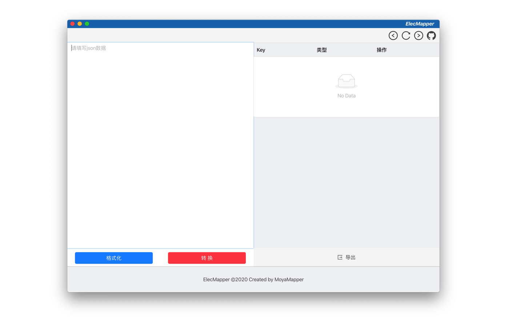
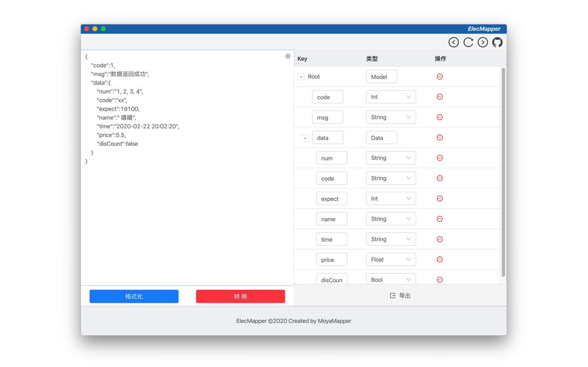

> `ElectMapper` 是为方便使用 `MoyaMapper` 而制作的 `JSON` 转模型 工具


## 下载

- Release: https://github.com/MoyaMapper/elecmapper/releases


## 特性

- 格式化 `json` 数据
- 对调整 `转换` 后的数据进行调整
- 将数据导出为 `Swift` 模型文件




## 使用

1. 将 `json数据` 粘贴至左边的编辑框内，点击 `转换`
2. 在右边的调整区进行调整内容
3. 点击导出，输出 `Swift` 模型文件




## 开发

```shell
git clone git@github.com:MoyaMapper/elecmapper.git
cd elecmapper
npm i

# 运行
npm run dev
```


## License

MIT